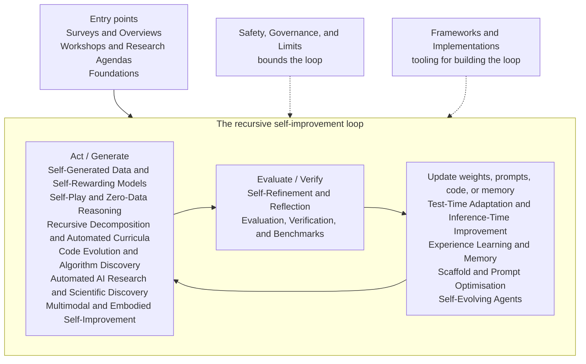

# Awesome Recursive Self-Improvement

> A curated list of resources on recursive self-improvement in AI: systems that improve their own performance loops through feedback, experience, self-evaluation, tool use, code evolution, automated curricula, test-time adaptation, and governed update loops.

Entries are organised by where the improvement lands. **Inference-time** methods refine an output and discard the gain when the episode ends. **Data- and weight-level** methods generate their own training signal — data, rewards, curricula — and update the model on it. **Process-level** methods improve the improvement mechanism itself: prompts, scaffolds, agent code, or update rules. Process-level loops are recursion proper: their gains compound, because each improvement applies to the machinery that produces the next one.

Selection is strict: resources from 2022 onwards (except a bounded [Foundations](#foundations) section), primary sources only, one neutral sentence per entry, and every link verified in CI. See [CONTRIBUTING.md](CONTRIBUTING.md) for the full criteria.

## Contents

- [Field Map](#field-map)
- [Reading Paths](#reading-paths)
- [Surveys and Overviews](#surveys-and-overviews)
- [Workshops and Research Agendas](#workshops-and-research-agendas)
- [Foundations](#foundations)
- [Self-Refinement and Reflection](#self-refinement-and-reflection)
- [Test-Time Adaptation and Inference-Time Improvement](#test-time-adaptation-and-inference-time-improvement)
- [Experience Learning and Memory](#experience-learning-and-memory)
- [Self-Generated Data and Self-Rewarding Models](#self-generated-data-and-self-rewarding-models)
- [Self-Play and Zero-Data Reasoning](#self-play-and-zero-data-reasoning)
- [Recursive Decomposition and Automated Curricula](#recursive-decomposition-and-automated-curricula)
- [Scaffold and Prompt Optimisation](#scaffold-and-prompt-optimisation)
- [Code Evolution and Algorithm Discovery](#code-evolution-and-algorithm-discovery)
- [Self-Evolving Agents](#self-evolving-agents)
- [Automated AI Research and Scientific Discovery](#automated-ai-research-and-scientific-discovery)
- [Multimodal and Embodied Self-Improvement](#multimodal-and-embodied-self-improvement)
- [Frameworks and Implementations](#frameworks-and-implementations)
- [Evaluation, Verification, and Benchmarks](#evaluation-verification-and-benchmarks)
- [Safety, Governance, and Limits](#safety-governance-and-limits)
- [Related Awesome Lists](#related-awesome-lists)
- [Contributing](#contributing)
- [Licence](#licence)

## Field Map

How the sections of this list fit together as one improvement loop: a system acts or generates, the result is evaluated or verified, and the improvement lands somewhere durable before the loop repeats. Safety work bounds the whole loop rather than sitting inside it; frameworks are the tooling used to build it.

## Reading Paths

Three short routes through the list, from accessible to advanced. Each item names an entry below; the link jumps to its section.

### New to the field

1. [Self-Improvement of Large Language Models: A Technical Overview and Future Outlook](#surveys-and-overviews) — a closed-loop map of the whole field.
2. [Welcome to the Era of Experience](#workshops-and-research-agendas) — the case for learning from experience rather than static data.
3. [Self-Refine: Iterative Refinement with Self-Feedback](#self-refinement-and-reflection) — the simplest self-improvement loop.
4. [Reflexion: Language Agents with Verbal Reinforcement Learning](#self-refinement-and-reflection) — reflection stored as memory across trials.
5. [STaR: Bootstrapping Reasoning With Reasoning](#self-generated-data-and-self-rewarding-models) — the founding modern bootstrap: train on your own correct reasoning.
6. [Self-Rewarding Language Models](#self-generated-data-and-self-rewarding-models) — the model as its own judge.
7. [Constitutional AI: Harmlessness from AI Feedback](#self-generated-data-and-self-rewarding-models) — AI feedback at training scale.

### Building self-improving systems

1. [DSPy](#frameworks-and-implementations) — an optimiser-driven pipeline framework to start building with.
2. [Voyager: An Open-Ended Embodied Agent with Large Language Models](#multimodal-and-embodied-self-improvement) — automatic curricula plus a growing skill library.
3. [Agent Workflow Memory](#experience-learning-and-memory) — reusable workflows induced from past trajectories.
4. [Self-Adapting Language Models](#self-evolving-agents) — models that direct their own updates.
5. [Absolute Zero: Reinforced Self-play Reasoning with Zero Data](#self-play-and-zero-data-reasoning) — training without any external data.
6. [Darwin Gödel Machine: Open-Ended Evolution of Self-Improving Agents](#code-evolution-and-algorithm-discovery) — agents that modify their own code.
7. [MLE-bench: Evaluating Machine Learning Agents on Machine Learning Engineering](#evaluation-verification-and-benchmarks) — measuring whether the loop actually works.

### Safety and limits

1. [Safety is Essential for Responsible Open-Ended Systems](#safety-governance-and-limits) — framing the risks of open-ended improvement.
2. [Reward Hacking Benchmark: Measuring Exploits in LLM Agents with Tool Use](#safety-governance-and-limits) — when the loop optimises the wrong thing.
3. [SHADE-Arena: Evaluating Sabotage and Monitoring in LLM Agents](#safety-governance-and-limits) — hidden objectives and monitoring.
4. [RepliBench: Evaluating the Autonomous Replication Capabilities of Language Model Agents](#safety-governance-and-limits) — measuring autonomous replication.
5. [AI models collapse when trained on recursively generated data](#safety-governance-and-limits) — the degenerate limit of recursive training.

## Surveys and Overviews

Recent surveys and overview papers that organise self-evolving agents, self-improving models, multimodal self-improvement, and closed-loop improvement systems.

- [Self-Improvement of Large Language Models: A Technical Overview and Future Outlook](https://arxiv.org/abs/2603.25681) (arXiv 2026) - Organises LLM self-improvement as a closed-loop lifecycle of data acquisition, selection, optimisation, inference refinement, and autonomous evaluation.
- [A Comprehensive Survey of Self-Evolving AI Agents](https://arxiv.org/abs/2508.07407) (arXiv 2025) - Surveys agent evolution through system inputs, agent components, environments, and optimisers for lifelong agentic systems.
- [A Survey of Self-Evolving Agents](https://arxiv.org/abs/2507.21046) (arXiv 2025) - Categorises mechanisms for adapting agent models, memory, tools, and architectures across intra-test-time and inter-test-time settings.
- [Self-Improvement in Multimodal Large Language Models: A Survey](https://aclanthology.org/2025.findings-emnlp.105/) (EMNLP Findings 2025) - Reviews methods for multimodal models to improve through feedback, synthetic data, self-training, and evaluation loops.
- [A Survey on Self-Evolution of Large Language Models](https://arxiv.org/abs/2404.14387) (arXiv 2024) - Frames LLM self-evolution as iterative experience acquisition, refinement, updating, and evaluation.

## Workshops and Research Agendas

- [ICLR 2026 Workshop: AI with Recursive Self-Improvement](https://recursive-workshop.github.io/) (ICLR 2026) - Presents the workshop scope for algorithmic foundations, evaluation, and safety of self-improving AI systems.
- [Accepted Papers: ICLR 2026 Workshop on Recursive Self-Improvement](https://recursive-workshop.github.io/papers.html) (ICLR 2026) - Lists accepted workshop papers on execution-grounded research, self-improving agents, recursive thinking, and evaluation-efficient improvement.
- [Focus Areas for The Anthropic Institute](https://www.anthropic.com/research/anthropic-institute-agenda) - Sets out Anthropic Institute research directions including AI-driven R&D and implications of recursive self-improvement.
- [Welcome to the Era of Experience](https://storage.googleapis.com/deepmind-media/Era-of-Experience%20/The%20Era%20of%20Experience%20Paper.pdf) (Google DeepMind 2025) - Argues for agents that improve through long streams of grounded experience rather than only static human-generated data.

## Foundations

A deliberately bounded set of pre-2022 landmarks that the modern field builds on. This section is closed to new entries; the 2022 recency rule applies everywhere else in the list.

- [Goedel Machines: Self-Referential Universal Problem Solvers Making Provably Optimal Self-Improvements](https://arxiv.org/abs/cs/0309048) (arXiv 2003) - Formalises a machine that rewrites any part of its own code once it can prove the rewrite improves expected utility.
- [PowerPlay: Training an Increasingly General Problem Solver by Continually Searching for the Simplest Still Unsolvable Problem](https://arxiv.org/abs/1112.5309) (arXiv 2011) - Pairs automatic task invention with solver improvement so a system builds its own curriculum of just-solvable problems.
- [Mastering the game of Go without human knowledge](https://www.nature.com/articles/nature24270) (Nature 2017) - Demonstrates superhuman Go play learned entirely from self-play reinforcement learning without human data.
- [Paired Open-Ended Trailblazer (POET): Endlessly Generating Increasingly Complex and Diverse Learning Environments and Their Solutions](https://arxiv.org/abs/1901.01753) (arXiv 2019) - Co-evolves environments and agents so increasingly complex challenges and their solutions are generated together.
- [AI-GAs: AI-generating algorithms, an alternate paradigm for producing general artificial intelligence](https://arxiv.org/abs/1905.10985) (arXiv 2019) - Argues for learning the components of intelligence-producing pipelines — architectures, algorithms, and environments — rather than hand-designing them.

## Self-Refinement and Reflection

Inference-time loops in which a system critiques and revises a specific output; the gain lives within the episode unless explicitly stored.

- [Self-Refine: Iterative Refinement with Self-Feedback](https://arxiv.org/abs/2303.17651) (arXiv 2023) [[code](https://github.com/madaan/self-refine)] - Introduces an iterative self-feedback method for improving model outputs without additional training.
- [Reflexion: Language Agents with Verbal Reinforcement Learning](https://papers.nips.cc/paper_files/paper/2023/hash/1b44b878bb782e6954cd888628510e90-Abstract-Conference.html) (NeurIPS 2023) [[code](https://github.com/noahshinn/reflexion)] - Studies agents that convert feedback into verbal reflections stored in memory for future trials.
- [Training Language Models to Self-Correct via Reinforcement Learning](https://arxiv.org/abs/2409.12917) (arXiv 2024) - Trains models on their own correction traces to improve test-time self-correction behaviour.
- [ReVISE: Learning to Refine at Test-Time via Intrinsic Self-Verification](https://arxiv.org/abs/2502.14565) (arXiv 2025) - Trains models to refine answers at test time using intrinsic self-verification signals.

## Test-Time Adaptation and Inference-Time Improvement

Improvement applied during deployment that persists across queries: weights, memories, or strategies updated at test time rather than in a separate training phase.

- [Test-time Recursive Thinking: Self-Improvement without External Feedback](https://arxiv.org/abs/2602.03094) (arXiv 2026) - Proposes a test-time framework that improves reasoning through rollout-specific strategies, accumulated knowledge, and self-generated verification.
- [TTRL: Test-Time Reinforcement Learning](https://arxiv.org/abs/2504.16084) (arXiv 2025) [[code](https://github.com/PRIME-RL/TTRL)] - Applies reinforcement learning to unlabelled test data using model-generated responses as the basis for rewards.
- [Dynamic Cheatsheet: Test-Time Learning with Adaptive Memory](https://arxiv.org/abs/2504.07952) (arXiv 2025) [[code](https://github.com/suzgunmirac/dynamic-cheatsheet)] - Adds persistent self-curated memory so black-box language models can reuse validated strategies across inference episodes.
- [Continuous Self-Improvement of Large Language Models by Test-time Training with Verifier-Driven Sample Selection](https://arxiv.org/abs/2505.19475) (arXiv 2025) - Uses verifier-selected self-generated samples for continuous test-time training.

## Experience Learning and Memory

Improvement that lands in durable memory: trajectories, workflows, and principles distilled from past episodes and reused across tasks.

- [Contextual Experience Replay for Self-Improvement of Language Agents](https://aclanthology.org/2025.acl-long.694/) (ACL 2025) - Enables language agents to distil, retrieve, and replay past experience within the context window.
- [Investigate-Consolidate-Exploit: A General Strategy for Inter-Task Agent Self-Evolution](https://arxiv.org/abs/2401.13996) (arXiv 2024) - Proposes an inter-task loop for agents to investigate tasks, consolidate reusable experience, and exploit it on future tasks.
- [Agent Learning via Early Experience](https://arxiv.org/abs/2510.08558) (arXiv 2025) - Studies how agents can learn from their own early rollouts before reinforcement learning with explicit rewards.
- [Learning from Successful Experiences Improves LLM Agents](https://arxiv.org/abs/2505.00234) (arXiv 2025) - Shows that accumulating and reusing successful self-generated trajectories can improve sequential decision-making agents.
- [Agent Workflow Memory](https://arxiv.org/abs/2409.07429) (arXiv 2024) [[code](https://github.com/zorazrw/agent-workflow-memory)] - Induces reusable workflows from past agent trajectories and supplies them as memory to guide future tasks.
- [Memp: Exploring Agent Procedural Memory](https://arxiv.org/abs/2508.06433) (arXiv 2025) - Distils agent trajectories into procedural memory with strategies for building, retrieving, and updating it as experience accumulates.
- [EvolveR: Self-Evolving LLM Agents through an Experience-Driven Lifecycle](https://arxiv.org/abs/2510.16079) (arXiv 2025) - Closes the loop between offline distillation of strategic principles and online interaction in which agents retrieve and reinforce them.
- [Rethinking Continual Experience Internalization for Self-Evolving LLM Agents](https://arxiv.org/abs/2606.04703) (arXiv 2026) - Analyses why repeated experience-internalisation cycles destabilise agents and proposes principle-level experience with step-wise injection and off-policy distillation.
- [Sample-Efficient Learning from Agent Experience](https://arxiv.org/abs/2607.21051) (arXiv 2026) - Distils trial-and-error interaction histories into model weights without requiring further environment interactions.

## Self-Generated Data and Self-Rewarding Models

Data- and weight-level loops: the model produces its own training signal — data, rationales, rewards, or preferences — and is updated on it.

- [STaR: Bootstrapping Reasoning With Reasoning](https://arxiv.org/abs/2203.14465) (arXiv 2022) [[code](https://github.com/ezelikman/STaR)] - Bootstraps reasoning ability by iteratively fine-tuning a model on its own generated rationales that lead to correct answers.
- [Reinforced Self-Training (ReST) for Language Modeling](https://arxiv.org/abs/2308.08998) (arXiv 2023) - Alternates between sampling a dataset from the current policy and improving the policy offline on reward-filtered samples.
- [Beyond Human Data: Scaling Self-Training for Problem-Solving with Language Models](https://arxiv.org/abs/2312.06585) (arXiv 2023) - Scales expectation-maximisation self-training on model-generated, verifier-filtered solutions beyond what fine-tuning on human data achieves.
- [RLAIF vs. RLHF: Scaling Reinforcement Learning from Human Feedback with AI Feedback](https://arxiv.org/abs/2309.00267) (arXiv 2023) - Shows that AI-generated preference labels can match human feedback for reinforcement learning across summarisation and dialogue tasks.
- [Self-Rewarding Language Models](https://arxiv.org/abs/2401.10020) (arXiv 2024) - Uses the language model itself as a judge to produce rewards for iterative instruction following and preference training.
- [Meta-Rewarding Language Models](https://arxiv.org/abs/2407.19594) (arXiv 2024) - Trains models to improve both task responses and the reward judgements used to select them.
- [Direct Nash Optimization: Teaching Language Models to Self-Improve with General Preferences](https://arxiv.org/abs/2404.03715) (arXiv 2024) - Introduces an iterative preference-optimisation method with monotonic improvement over a strong oracle.
- [Constitutional AI: Harmlessness from AI Feedback](https://arxiv.org/abs/2212.08073) (arXiv 2022) - Demonstrates critique, revision, and preference modelling using AI feedback instead of human labels for harmlessness training.
- [WizardLM: Empowering Large Language Models to Follow Complex Instructions](https://arxiv.org/abs/2304.12244) (arXiv 2023) [[code](https://github.com/nlpxucan/WizardLM)] - Introduces Evol-Instruct for generating increasingly complex instruction data from seed examples.

## Self-Play and Zero-Data Reasoning

Loops in which a model trains against itself or its own previous iterations, generating tasks and opponents instead of consuming external data.

- [Self-Play Fine-Tuning Converts Weak Language Models to Strong Language Models](https://arxiv.org/abs/2401.01335) (arXiv 2024) [[code](https://github.com/uclaml/SPIN)] - Trains a model against its own previous iteration so it learns to distinguish and surpass its earlier responses without new human data.
- [Absolute Zero: Reinforced Self-play Reasoning with Zero Data](https://arxiv.org/abs/2505.03335) (arXiv 2025) [[code](https://github.com/LeapLabTHU/Absolute-Zero-Reasoner)] - Trains a single model to propose and solve its own code-grounded reasoning tasks through self-play without any external data.
- [SPIRAL: Self-Play on Zero-Sum Games Incentivizes Reasoning via Multi-Agent Multi-Turn Reinforcement Learning](https://arxiv.org/abs/2506.24119) (arXiv 2025) - Shows that multi-turn self-play on zero-sum games against improving copies of a model produces transferable reasoning gains.
- [R-Zero: Self-Evolving Reasoning LLM from Zero Data](https://arxiv.org/abs/2508.05004) (arXiv 2025) [[code](https://github.com/Chengsong-Huang/R-Zero)] - Co-evolves a task-proposing challenger and a solver initialised from one base model so training data is generated entirely from scratch.
- [SPICE: Self-Play In Corpus Environments Improves Reasoning](https://arxiv.org/abs/2510.24684) (arXiv 2025) - Grounds adversarial self-play in a document corpus so a challenger can keep mining tasks at the frontier of the solver's ability.

## Recursive Decomposition and Automated Curricula

Systems that generate their own progression of tasks or sub-problems and learn from the self-built curriculum.

- [LADDER: Self-Improving LLMs Through Recursive Problem Decomposition](https://arxiv.org/abs/2503.00735) (arXiv 2025) - Recursively generates easier sub-problems so models can learn progressively from self-guided difficulty reduction.
- [Toward Self-Improvement of LLMs via Imagination, Searching, and Criticizing](https://arxiv.org/abs/2404.12253) (arXiv 2024) - Combines imagined tasks, Monte Carlo tree search, and critic feedback to build a self-improving learning loop.
- [OpenSIR: Open-Ended Self-Improving Reasoner](https://arxiv.org/abs/2511.00602) (arXiv 2025) - Alternates teacher and student roles so a model can generate and solve new reasoning problems without external supervision.

## Scaffold and Prompt Optimisation

Process-level loops in which prompts, workflows, and agent designs are themselves the object being optimised.

- [Promptbreeder: Self-Referential Self-Improvement via Prompt Evolution](https://arxiv.org/abs/2309.16797) (arXiv 2023) - Evolves task prompts together with the mutation prompts that improve them in a self-referential loop.
- [DSPy: Compiling Declarative Language Model Calls into Self-Improving Pipelines](https://arxiv.org/abs/2310.03714) (arXiv 2023) - Compiles declarative language-model pipelines whose prompts and weights are optimised automatically against a metric.
- [Automated Design of Agentic Systems](https://arxiv.org/abs/2408.08435) (arXiv 2024) [[code](https://github.com/ShengranHu/ADAS)] - Uses a meta-agent to programme, evaluate, and archive progressively better agent designs in code.
- [AFlow: Automating Agentic Workflow Generation](https://arxiv.org/abs/2410.10762) (arXiv 2024) - Searches over code-represented agent workflows with Monte Carlo tree search and execution feedback.
- [TextGrad: Automatic "Differentiation" via Text](https://arxiv.org/abs/2406.07496) (arXiv 2024) - Backpropagates natural-language feedback through compound AI systems to optimise prompts, outputs, and code.
- [Language Agents as Optimizable Graphs](https://arxiv.org/abs/2402.16823) (arXiv 2024) - Represents language-agent workflows as graphs whose prompts and connections can be automatically optimised.

## Code Evolution and Algorithm Discovery

Process-level loops in which systems modify code — including their own — and keep improvements selected by evaluation.

- [Mathematical discoveries from program search with large language models](https://www.nature.com/articles/s41586-023-06924-6) (Nature 2024) - Evolves programs proposed by a language model against automated evaluators to discover new mathematical constructions and heuristics.
- [AlphaEvolve: A Coding Agent for Scientific and Algorithmic Discovery](https://arxiv.org/abs/2506.13131) (arXiv 2025) - Presents an evolutionary coding agent that proposes, tests, and selects algorithmic improvements across mathematics and computing infrastructure.
- [Darwin Gödel Machine: Open-Ended Evolution of Self-Improving Agents](https://arxiv.org/abs/2505.22954) (arXiv 2025) [[code](https://github.com/jennyzzt/dgm)] - Evolves coding agents by modifying their code, evaluating variants, and maintaining an archive of successful descendants.
- [Self-Taught Optimizer: Recursively Self-Improving Code Generation](https://arxiv.org/abs/2310.02304) (arXiv 2023) - Demonstrates a code-improver scaffold that recursively rewrites its own improvement procedure under a utility function.
- [ReVeal: Self-Evolving Code Agents via Iterative Generation-Verification](https://arxiv.org/abs/2506.11442) (arXiv 2025) - Improves code generation through reinforcement learning over iterative generation, self-verification, and tool-based evaluation.
- [Huxley-Gödel Machine: Human-Level Coding Agent Development by an Approximation of the Optimal Self-Improving Machine](https://arxiv.org/abs/2510.21614) (arXiv 2025) - Guides the search over a coding agent's self-modifications using a lineage-based estimate of long-term improvement potential.

## Self-Evolving Agents

Agents that update their own components — self-models, tools, skills, or update rules — in the course of operating.

- [Gödel Agent: A Self-Referential Agent Framework for Recursive Self-Improvement](https://aclanthology.org/2025.acl-long.1354/) (ACL 2025) [[code](https://github.com/Arvid-pku/Godel_Agent)] - Proposes a self-referential agent framework that updates its own self-model and improvement routines.
- [Self-Adapting Language Models](https://arxiv.org/abs/2506.10943) (arXiv 2025) - Enables models to generate their own finetuning data and update directives for self-directed adaptation.
- [Agentic Neural Networks: Self-Evolving Multi-Agent Systems via Textual Backpropagation](https://arxiv.org/abs/2506.09046) (arXiv 2025) - Uses textual feedback to adapt multi-agent roles, prompts, and coordination patterns.
- [SkillWeaver: Web Agents can Self-Improve by Discovering and Honing Skills](https://arxiv.org/abs/2504.07079) (arXiv 2025) [[code](https://github.com/OSU-NLP-Group/SkillWeaver)] - Grows a library of reusable skills that web agents discover, practise, and distil into callable APIs.
- [Alita: Generalist Agent Enabling Scalable Agentic Reasoning with Minimal Predefinition and Maximal Self-Evolution](https://arxiv.org/abs/2505.20286) (arXiv 2025) - Constructs, refines, and reuses task-related tool protocols at run time instead of relying on predefined tools and workflows.

## Automated AI Research and Scientific Discovery

The outer loop: agents that run parts of the research process that produces better AI systems and scientific results.

- [The AI Scientist-v2: Workshop-Level Automated Scientific Discovery via Agentic Tree Search](https://arxiv.org/abs/2504.08066) (arXiv 2025) [[code](https://github.com/SakanaAI/AI-Scientist-v2)] - Automates hypothesis generation, experimentation, and paper writing through agentic tree search with vision-language feedback on results.
- [AlphaGo Moment for Model Architecture Discovery](https://arxiv.org/abs/2507.18074) (arXiv 2025) - Runs an autonomous loop that proposes, trains, and analyses novel linear-attention architectures across thousands of experiments.
- [AI Research Agents for Machine Learning: Search, Exploration, and Generalization in MLE-bench](https://arxiv.org/abs/2507.02554) (arXiv 2025) - Analyses search policies, exploration strategies, and generalisation gaps for AI research agents on MLE-bench.
- [STELLA: Self-Evolving LLM Agent for Biomedical Research](https://arxiv.org/abs/2507.02004) (arXiv 2025) - Builds a biomedical agent that evolves reasoning templates and expands its tool library from experience.

## Multimodal and Embodied Self-Improvement

Self-improvement loops grounded in visual, simulated, or embodied environments.

- [Voyager: An Open-Ended Embodied Agent with Large Language Models](https://arxiv.org/abs/2305.16291) (arXiv 2023) [[code](https://github.com/MineDojo/Voyager)] - Combines automatic curricula, an expanding skill library, and environment feedback for continual Minecraft learning.
- [JARVIS-1: Open-World Multi-task Agents with Memory-Augmented Multimodal Language Models](https://arxiv.org/abs/2311.05997) (arXiv 2023) [[code](https://github.com/CraftJarvis/JARVIS-1)] - Uses multimodal memory and planning for open-world Minecraft agents that improve across tasks.
- [SRUM: Fine-Grained Self-Rewarding for Unified Multimodal Models](https://arxiv.org/abs/2510.12784) (arXiv 2025) - Applies self-rewarding post-training to unified multimodal models.
- [SIMA 2: A Generalist Embodied Agent for Virtual Worlds](https://arxiv.org/abs/2512.04797) (arXiv 2025) - Pairs a Gemini reasoning core with self-generated tasks and rewards so an embodied agent can learn new skills in new 3D worlds without human demonstrations.
- [Automating the Design of Embodied Agent Architectures](https://jianzhou0420.github.io/src/works/AgentCanvas/paper.html) (arXiv 2026) [[code](https://github.com/jianzhou0420/AgentCanvas)] - Introduces AgentCanvas and KDLoop for searching embodied agent architectures as editable typed graphs through coding-agent proposal, critique, experimentation, and distillation.

## Frameworks and Implementations

Maintained open-source software for building self-improvement loops. Research code for an individual paper is linked as `[code]` from that paper's entry instead.

- [DSPy](https://github.com/stanfordnlp/dspy) - Python framework for composing language-model programs from declarative modules with built-in prompt and weight optimisers.
- [TextGrad](https://github.com/zou-group/textgrad) - Library that optimises prompts, outputs, and code in compound AI systems by backpropagating textual feedback.
- [OpenEvolve](https://github.com/codelion/openevolve) - Open-source evolutionary coding agent that iteratively improves programs using LLM-proposed mutations and automated evaluation.
- [EvoAgentX](https://github.com/EvoAgentX/EvoAgentX) - Open-source platform for generating, executing, and evolutionarily optimising agent workflows.

## Evaluation, Verification, and Benchmarks

Benchmarks and evaluations that measure whether improvement loops actually improve anything.

- [MLE-bench: Evaluating Machine Learning Agents on Machine Learning Engineering](https://arxiv.org/abs/2410.07095) (arXiv 2024) [[code](https://github.com/openai/mle-bench)] - Evaluates agents on real machine-learning engineering tasks derived from Kaggle competitions.
- [ScienceAgentBench: Toward Rigorous Assessment of Language Agents for Data-Driven Scientific Discovery](https://openreview.net/forum?id=6z4YKr0GK6) (ICLR 2025) [[code](https://github.com/OSU-NLP-Group/ScienceAgentBench)] - Benchmarks language agents on code-driven tasks in data-driven scientific discovery.
- [AIRS-Bench: a Suite of Tasks for Frontier AI Research Science Agents](https://arxiv.org/abs/2602.06855) (arXiv 2026) - Measures whether agents can handle the research lifecycle through idea generation, experiment analysis, and iterative refinement tasks.

## Safety, Governance, and Limits

Failure modes, dangerous-capability evaluations, and governance mechanisms that bound the loop.

- [Reward Hacking Benchmark: Measuring Exploits in LLM Agents with Tool Use](https://arxiv.org/abs/2605.02964) (arXiv 2026) - Measures exploit-seeking behaviour in tool-using language model agents trained with reinforcement learning.
- [EvilGenie: A Reward Hacking Benchmark](https://futuretech.mit.edu/publication/evilgenie-a-reward-hacking-benchmark) - Tests whether coding agents exploit benchmark loopholes such as hard-coded cases or modified test files.
- [AgentHarm: A Benchmark for Measuring Harmfulness of LLM Agents](https://arxiv.org/abs/2410.09024) (arXiv 2024) - Evaluates whether LLM agents comply with or refuse malicious multi-step tasks.
- [SHADE-Arena: Evaluating Sabotage and Monitoring in LLM Agents](https://arxiv.org/abs/2506.15740) (arXiv 2025) - Tests whether agents can pursue hidden harmful objectives while evading monitoring.
- [Safety is Essential for Responsible Open-Ended Systems](https://arxiv.org/abs/2502.04512) (arXiv 2025) - Analyses safety risks and mitigation strategies for dynamic open-ended systems that can propagate and change over time.
- [AI models collapse when trained on recursively generated data](https://www.nature.com/articles/s41586-024-07566-y) (Nature 2024) - Shows that recursively training generative models on model-generated data can cause distributional collapse.
- [Evaluating Frontier Models for Dangerous Capabilities](https://arxiv.org/abs/2403.13793) (arXiv 2024) - Pilots evaluations of frontier models for dangerous capabilities including self-proliferation and self-reasoning.
- [RepliBench: Evaluating the Autonomous Replication Capabilities of Language Model Agents](https://arxiv.org/abs/2504.18565) (arXiv 2025) - Decomposes autonomous replication into component capabilities and measures frontier language model agents on each.
- [Zombie Agents: Persistent Control of Self-Evolving LLM Agents via Self-Reinforcing Injections](https://arxiv.org/abs/2602.15654) (arXiv 2026) - Shows that one-time prompt injections can persist in the evolving memory of self-improving agents and survive per-session defences.
- [Weak-to-Strong Generalization: Eliciting Strong Capabilities With Weak Supervision](https://arxiv.org/abs/2312.09390) (arXiv 2023) - Studies how strong models trained on labels from weaker supervisors can recover capabilities beyond their supervision, as an empirical setting for overseeing models stronger than their overseers.
- [Anthropic's Responsible Scaling Policy](https://www.anthropic.com/news/anthropics-responsible-scaling-policy) (Anthropic 2023) - Defines capability thresholds, including autonomy-related capabilities, that trigger stronger safeguards before further scaling.
- [Introducing the Frontier Safety Framework](https://deepmind.google/discover/blog/introducing-the-frontier-safety-framework/) (Google DeepMind 2024) - Sets out critical capability levels, including machine-learning research automation, with mitigations applied as models approach them.
- [METR](https://metr.org/) - Research organisation that evaluates frontier AI systems for autonomous-replication and AI research-and-development capabilities.

## Related Awesome Lists

- [Awesome Self-Evolving Agents](https://github.com/EvoAgentX/Awesome-Self-Evolving-Agents) - Companion resource list to a survey of self-evolving agent techniques across optimisers, components, and domains.
- [Awesome LLM Reasoning](https://github.com/atfortes/Awesome-LLM-Reasoning) - Curates papers on reasoning in large language models, including self-improvement and search-based methods.
- [Awesome AgentOps](https://github.com/natnew/awesome-agentops) - Tracks operational practices and tooling for deploying, observing, and evaluating AI agents.
- [Awesome RL for Agents](https://github.com/natnew/awesome-rl-for-agents) - Curates reinforcement learning resources for agentic AI systems.
- [Awesome Physical AI](https://github.com/natnew/awesome-physical-ai) - Collects resources on embodied, robotic, and world-interacting AI systems.

## Contributing

Contributions are welcome, from a single new entry to a taxonomy fix. Read the [contributing guide](CONTRIBUTING.md) first; running your entry through the review checklist (`.github/skills/review-entry/SKILL.md`) makes review faster for everyone.

## Licence

Released under the [MIT License](LICENSE).
