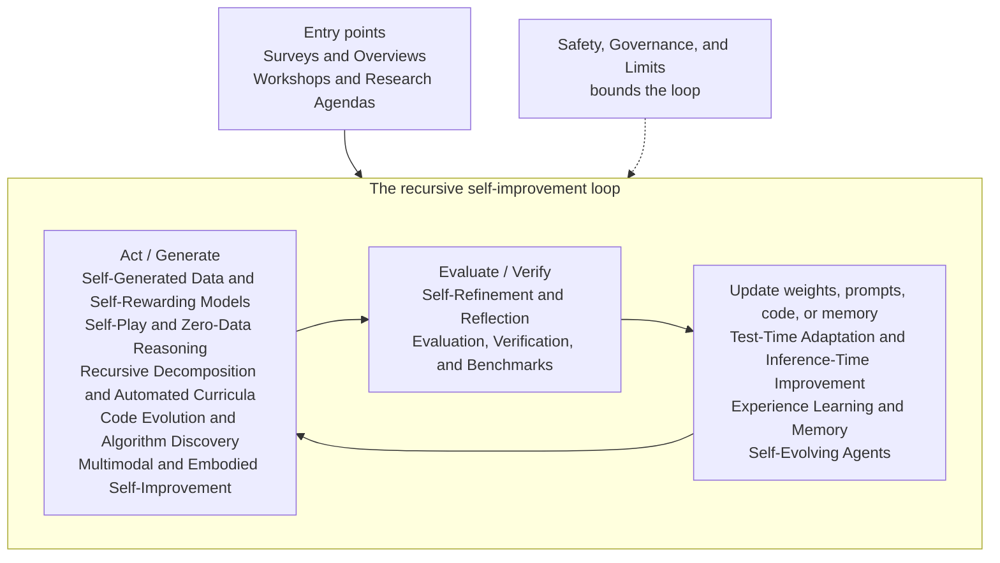

# Awesome Recursive Self-Improvement

> A curated list of recent resources on recursive self-improvement in AI: systems that improve through feedback, experience, self-evaluation, tool use, code evolution, automated curricula, test-time adaptation, and governed update loops.

Recursive self-improvement in AI refers to systems that improve their own performance loops through feedback, experience, self-evaluation, environment interaction, tool use, code modification, synthetic data generation, or governed update mechanisms.

## Contents

- [Field Map](#field-map)
- [Reading Paths](#reading-paths)
- [Surveys and Overviews](#surveys-and-overviews)
- [Workshops and Research Agendas](#workshops-and-research-agendas)
- [Self-Refinement and Reflection](#self-refinement-and-reflection)
- [Test-Time Adaptation and Inference-Time Improvement](#test-time-adaptation-and-inference-time-improvement)
- [Experience Learning and Memory](#experience-learning-and-memory)
- [Self-Generated Data and Self-Rewarding Models](#self-generated-data-and-self-rewarding-models)
- [Self-Play and Zero-Data Reasoning](#self-play-and-zero-data-reasoning)
- [Recursive Decomposition and Automated Curricula](#recursive-decomposition-and-automated-curricula)
- [Code Evolution and Algorithm Discovery](#code-evolution-and-algorithm-discovery)
- [Self-Evolving Agents](#self-evolving-agents)
- [Multimodal and Embodied Self-Improvement](#multimodal-and-embodied-self-improvement)
- [Evaluation, Verification, and Benchmarks](#evaluation-verification-and-benchmarks)
- [Safety, Governance, and Limits](#safety-governance-and-limits)
- [Related Awesome Lists](#related-awesome-lists)
- [Contributing](#contributing)
- [Licence](#licence)

## Field Map

How the sections of this list fit together as one improvement loop: a system acts or generates, the result is evaluated or verified, and the improvement lands somewhere durable before the loop repeats. Safety work bounds the whole loop rather than sitting inside it.

## Reading Paths

Three short routes through the list, from accessible to advanced. Each item names an entry below; the link jumps to its section.

### New to the field

1. [Self-Improvement of Large Language Models: A Technical Overview and Future Outlook](#surveys-and-overviews) — a closed-loop map of the whole field.
2. [Welcome to the Era of Experience](#workshops-and-research-agendas) — the case for learning from experience rather than static data.
3. [Self-Refine: Iterative Refinement with Self-Feedback](#self-refinement-and-reflection) — the simplest self-improvement loop.
4. [Reflexion: Language Agents with Verbal Reinforcement Learning](#self-refinement-and-reflection) — reflection stored as memory across trials.
5. [Self-Rewarding Language Models](#self-generated-data-and-self-rewarding-models) — the model as its own judge.
6. [Constitutional AI: Harmlessness from AI Feedback](#self-generated-data-and-self-rewarding-models) — AI feedback at training scale.

### Building self-improving systems

1. [Voyager: An Open-Ended Embodied Agent with Large Language Models](#multimodal-and-embodied-self-improvement) — automatic curricula plus a growing skill library.
2. [Agent Workflow Memory](#experience-learning-and-memory) — reusable workflows induced from past trajectories.
3. [Self-Adapting Language Models](#self-evolving-agents) — models that direct their own updates.
4. [Absolute Zero: Reinforced Self-play Reasoning with Zero Data](#self-play-and-zero-data-reasoning) — training without any external data.
5. [Darwin Gödel Machine: Open-Ended Evolution of Self-Improving Agents](#code-evolution-and-algorithm-discovery) — agents that modify their own code.
6. [MLE-bench: Evaluating Machine Learning Agents on Machine Learning Engineering](#evaluation-verification-and-benchmarks) — measuring whether the loop actually works.

### Safety and limits

1. [Safety is Essential for Responsible Open-Ended Systems](#safety-governance-and-limits) — framing the risks of open-ended improvement.
2. [Reward Hacking Benchmark: Measuring Exploits in LLM Agents with Tool Use](#safety-governance-and-limits) — when the loop optimises the wrong thing.
3. [SHADE-Arena: Evaluating Sabotage and Monitoring in LLM Agents](#safety-governance-and-limits) — hidden objectives and monitoring.
4. [RepliBench: Evaluating the Autonomous Replication Capabilities of Language Model Agents](#safety-governance-and-limits) — measuring autonomous replication.
5. [AI models collapse when trained on recursively generated data](#safety-governance-and-limits) — the degenerate limit of recursive training.

## Surveys and Overviews

Recent surveys and overview papers that organise self-evolving agents, self-improving models, multimodal self-improvement, and closed-loop improvement systems.

- [Self-Improvement of Large Language Models: A Technical Overview and Future Outlook](https://arxiv.org/abs/2603.25681) - Organises LLM self-improvement as a closed-loop lifecycle of data acquisition, selection, optimisation, inference refinement, and autonomous evaluation.
- [A Comprehensive Survey of Self-Evolving AI Agents](https://arxiv.org/abs/2508.07407) - Surveys agent evolution through system inputs, agent components, environments, and optimisers for lifelong agentic systems.
- [A Survey of Self-Evolving Agents](https://arxiv.org/abs/2507.21046) - Categorises mechanisms for adapting agent models, memory, tools, and architectures across intra-test-time and inter-test-time settings.
- [Self-Improvement in Multimodal Large Language Models: A Survey](https://aclanthology.org/2025.findings-emnlp.105/) - Reviews methods for multimodal models to improve through feedback, synthetic data, self-training, and evaluation loops.
- [A Survey on Self-Evolution of Large Language Models](https://arxiv.org/abs/2404.14387) - Frames LLM self-evolution as iterative experience acquisition, refinement, updating, and evaluation.

## Workshops and Research Agendas

- [ICLR 2026 Workshop: AI with Recursive Self-Improvement](https://recursive-workshop.github.io/) - Presents the workshop scope for algorithmic foundations, evaluation, and safety of self-improving AI systems.
- [Accepted Papers: ICLR 2026 Workshop on Recursive Self-Improvement](https://recursive-workshop.github.io/papers.html) - Lists accepted workshop papers on execution-grounded research, self-improving agents, recursive thinking, and evaluation-efficient improvement.
- [Focus Areas for The Anthropic Institute](https://www.anthropic.com/research/anthropic-institute-agenda) - Sets out Anthropic Institute research directions including AI-driven R&D and implications of recursive self-improvement.
- [Welcome to the Era of Experience](https://storage.googleapis.com/deepmind-media/Era-of-Experience%20/The%20Era%20of%20Experience%20Paper.pdf) - Argues for agents that improve through long streams of grounded experience rather than only static human-generated data.

## Self-Refinement and Reflection

- [Self-Refine: Iterative Refinement with Self-Feedback](https://arxiv.org/abs/2303.17651) - Introduces an iterative self-feedback method for improving model outputs without additional training.
- [Reflexion: Language Agents with Verbal Reinforcement Learning](https://papers.nips.cc/paper_files/paper/2023/hash/1b44b878bb782e6954cd888628510e90-Abstract-Conference.html) - Studies agents that convert feedback into verbal reflections stored in memory for future trials.
- [Training Language Models to Self-Correct via Reinforcement Learning](https://arxiv.org/abs/2409.12917) - Trains models on their own correction traces to improve test-time self-correction behaviour.
- [ReVISE: Learning to Refine at Test-Time via Intrinsic Self-Verification](https://arxiv.org/abs/2502.14565) - Trains models to refine answers at test time using intrinsic self-verification signals.

## Test-Time Adaptation and Inference-Time Improvement

- [Test-time Recursive Thinking: Self-Improvement without External Feedback](https://arxiv.org/abs/2602.03094) - Proposes a test-time framework that improves reasoning through rollout-specific strategies, accumulated knowledge, and self-generated verification.
- [TTRL: Test-Time Reinforcement Learning](https://arxiv.org/abs/2504.16084) - Applies reinforcement learning to unlabelled test data using model-generated responses as the basis for rewards.
- [Dynamic Cheatsheet: Test-Time Learning with Adaptive Memory](https://arxiv.org/abs/2504.07952) - Adds persistent self-curated memory so black-box language models can reuse validated strategies across inference episodes.
- [Continuous Self-Improvement of Large Language Models by Test-time Training with Verifier-Driven Sample Selection](https://arxiv.org/abs/2505.19475) - Uses verifier-selected self-generated samples for continuous test-time training.
- [Scaling LLM Test-Time Compute Optimally can be More Effective than Scaling Model Parameters](https://arxiv.org/abs/2408.03314) - Analyses when allocating additional inference compute improves LLM reasoning more efficiently than increasing model size.

## Experience Learning and Memory

- [Contextual Experience Replay for Self-Improvement of Language Agents](https://aclanthology.org/2025.acl-long.694/) - Enables language agents to distil, retrieve, and replay past experience within the context window.
- [Investigate-Consolidate-Exploit: A General Strategy for Inter-Task Agent Self-Evolution](https://arxiv.org/abs/2401.13996) - Proposes an inter-task loop for agents to investigate tasks, consolidate reusable experience, and exploit it on future tasks.
- [Agent Learning via Early Experience](https://arxiv.org/abs/2510.08558) - Studies how agents can learn from their own early rollouts before reinforcement learning with explicit rewards.
- [Learning from Successful Experiences Improves LLM Agents](https://arxiv.org/abs/2505.00234) - Shows that accumulating and reusing successful self-generated trajectories can improve sequential decision-making agents.
- [Agent Workflow Memory](https://arxiv.org/abs/2409.07429) - Induces reusable workflows from past agent trajectories and supplies them as memory to guide future tasks.
- [Memp: Exploring Agent Procedural Memory](https://arxiv.org/abs/2508.06433) - Distils agent trajectories into procedural memory with strategies for building, retrieving, and updating it as experience accumulates.
- [EvolveR: Self-Evolving LLM Agents through an Experience-Driven Lifecycle](https://arxiv.org/abs/2510.16079) - Closes the loop between offline distillation of strategic principles and online interaction in which agents retrieve and reinforce them.
- [Rethinking Continual Experience Internalization for Self-Evolving LLM Agents](https://arxiv.org/abs/2606.04703) - Analyses why repeated experience-internalisation cycles destabilise agents and proposes principle-level experience with step-wise injection and off-policy distillation.

## Self-Generated Data and Self-Rewarding Models

- [Self-Rewarding Language Models](https://arxiv.org/abs/2401.10020) - Uses the language model itself as a judge to produce rewards for iterative instruction following and preference training.
- [Meta-Rewarding Language Models](https://arxiv.org/abs/2407.19594) - Trains models to improve both task responses and the reward judgements used to select them.
- [Direct Nash Optimization: Teaching Language Models to Self-Improve with General Preferences](https://arxiv.org/abs/2404.03715) - Introduces an iterative preference-optimisation method with monotonic improvement over a strong oracle.
- [Constitutional AI: Harmlessness from AI Feedback](https://arxiv.org/abs/2212.08073) - Demonstrates critique, revision, and preference modelling using AI feedback instead of human labels for harmlessness training.
- [WizardLM: Empowering Large Language Models to Follow Complex Instructions](https://arxiv.org/abs/2304.12244) - Introduces Evol-Instruct for generating increasingly complex instruction data from seed examples.

## Self-Play and Zero-Data Reasoning

- [Absolute Zero: Reinforced Self-play Reasoning with Zero Data](https://arxiv.org/abs/2505.03335) - Trains a single model to propose and solve its own code-grounded reasoning tasks through self-play without any external data.
- [SPIRAL: Self-Play on Zero-Sum Games Incentivizes Reasoning via Multi-Agent Multi-Turn Reinforcement Learning](https://arxiv.org/abs/2506.24119) - Shows that multi-turn self-play on zero-sum games against improving copies of a model produces transferable reasoning gains.
- [R-Zero: Self-Evolving Reasoning LLM from Zero Data](https://arxiv.org/abs/2508.05004) - Co-evolves a task-proposing challenger and a solver initialised from one base model so training data is generated entirely from scratch.
- [SPICE: Self-Play In Corpus Environments Improves Reasoning](https://arxiv.org/abs/2510.24684) - Grounds adversarial self-play in a document corpus so a challenger can keep mining tasks at the frontier of the solver's ability.

## Recursive Decomposition and Automated Curricula

- [LADDER: Self-Improving LLMs Through Recursive Problem Decomposition](https://arxiv.org/abs/2503.00735) - Recursively generates easier sub-problems so models can learn progressively from self-guided difficulty reduction.
- [Toward Self-Improvement of LLMs via Imagination, Searching, and Criticizing](https://arxiv.org/abs/2404.12253) - Combines imagined tasks, Monte Carlo tree search, and critic feedback to build a self-improving learning loop.
- [Tree of Thoughts: Deliberate Problem Solving with Large Language Models](https://arxiv.org/abs/2305.10601) - Uses search over intermediate thoughts with self-evaluation and backtracking during inference.
- [OpenSIR: Open-Ended Self-Improving Reasoner](https://arxiv.org/abs/2511.00602) - Alternates teacher and student roles so a model can generate and solve new reasoning problems without external supervision.

## Code Evolution and Algorithm Discovery

- [AlphaEvolve: A Gemini-powered coding agent for designing advanced algorithms](https://deepmind.google/blog/alphaevolve-a-gemini-powered-coding-agent-for-designing-advanced-algorithms/) - Presents an evolutionary coding agent that proposes, tests, and selects algorithmic improvements.
- [AlphaEvolve: Gemini-powered coding agent scaling impact across fields](https://deepmind.google/blog/alphaevolve-impact/) - Reports applied uses of AlphaEvolve across optimisation, chip design, infrastructure, and scientific workflows.
- [Darwin Gödel Machine: Open-Ended Evolution of Self-Improving Agents](https://arxiv.org/abs/2505.22954) - Evolves coding agents by modifying their code, evaluating variants, and maintaining an archive of successful descendants.
- [Self-Taught Optimizer: Recursively Self-Improving Code Generation](https://arxiv.org/abs/2310.02304) - Demonstrates a code-improver scaffold that recursively rewrites its own improvement procedure under a utility function.
- [Language Agents as Optimizable Graphs](https://arxiv.org/abs/2402.16823) - Represents language-agent workflows as graphs whose prompts and connections can be automatically optimised.
- [ReVeal: Self-Evolving Code Agents via Iterative Generation-Verification](https://arxiv.org/abs/2506.11442) - Improves code generation through reinforcement learning over iterative generation, self-verification, and tool-based evaluation.
- [The AI Scientist-v2: Workshop-Level Automated Scientific Discovery via Agentic Tree Search](https://arxiv.org/abs/2504.08066) - Automates hypothesis generation, experimentation, and paper writing through agentic tree search with vision-language feedback on results.
- [AlphaGo Moment for Model Architecture Discovery](https://arxiv.org/abs/2507.18074) - Runs an autonomous loop that proposes, trains, and analyses novel linear-attention architectures across thousands of experiments.
- [Huxley-Gödel Machine: Human-Level Coding Agent Development by an Approximation of the Optimal Self-Improving Machine](https://arxiv.org/abs/2510.21614) - Guides the search over a coding agent's self-modifications using a lineage-based estimate of long-term improvement potential.

## Self-Evolving Agents

- [Gödel Agent: A Self-Referential Agent Framework for Recursive Self-Improvement](https://aclanthology.org/2025.acl-long.1354/) - Proposes a self-referential agent framework that updates its own self-model and improvement routines.
- [Self-Adapting Language Models](https://arxiv.org/abs/2506.10943) - Enables models to generate their own finetuning data and update directives for self-directed adaptation.
- [Agentic Neural Networks: Self-Evolving Multi-Agent Systems via Textual Backpropagation](https://arxiv.org/abs/2506.09046) - Uses textual feedback to adapt multi-agent roles, prompts, and coordination patterns.
- [STELLA: Self-Evolving LLM Agent for Biomedical Research](https://arxiv.org/abs/2507.02004) - Builds a biomedical agent that evolves reasoning templates and expands its tool library from experience.
- [SkillWeaver: Web Agents can Self-Improve by Discovering and Honing Skills](https://arxiv.org/abs/2504.07079) - Grows a library of reusable skills that web agents discover, practise, and distil into callable APIs.
- [Alita: Generalist Agent Enabling Scalable Agentic Reasoning with Minimal Predefinition and Maximal Self-Evolution](https://arxiv.org/abs/2505.20286) - Constructs, refines, and reuses task-related tool protocols at run time instead of relying on predefined tools and workflows.

## Multimodal and Embodied Self-Improvement

- [Voyager: An Open-Ended Embodied Agent with Large Language Models](https://arxiv.org/abs/2305.16291) - Combines automatic curricula, an expanding skill library, and environment feedback for continual Minecraft learning.
- [JARVIS-1: Open-World Multi-task Agents with Memory-Augmented Multimodal Language Models](https://arxiv.org/abs/2311.05997) - Uses multimodal memory and planning for open-world Minecraft agents that improve across tasks.
- [SRUM: Fine-Grained Self-Rewarding for Unified Multimodal Models](https://arxiv.org/abs/2510.12784) - Applies self-rewarding post-training to unified multimodal models.
- [SIMA 2: A Generalist Embodied Agent for Virtual Worlds](https://arxiv.org/abs/2512.04797) - Pairs a Gemini reasoning core with self-generated tasks and rewards so an embodied agent can learn new skills in new 3D worlds without human demonstrations.

## Evaluation, Verification, and Benchmarks

- [MLE-bench: Evaluating Machine Learning Agents on Machine Learning Engineering](https://arxiv.org/abs/2410.07095) - Evaluates agents on real machine-learning engineering tasks derived from Kaggle competitions.
- [AI Research Agents for Machine Learning: Search, Exploration, and Generalization in MLE-bench](https://arxiv.org/abs/2507.02554) - Analyses search policies, exploration strategies, and generalisation gaps for AI research agents on MLE-bench.
- [ScienceAgentBench: Toward Rigorous Assessment of Language Agents for Data-Driven Scientific Discovery](https://openreview.net/forum?id=6z4YKr0GK6) - Benchmarks language agents on code-driven tasks in data-driven scientific discovery.
- [AIRS-Bench: a Suite of Tasks for Frontier AI Research Science Agents](https://arxiv.org/abs/2602.06855) - Measures whether agents can handle the research lifecycle through idea generation, experiment analysis, and iterative refinement tasks.

## Safety, Governance, and Limits

- [Reward Hacking Benchmark: Measuring Exploits in LLM Agents with Tool Use](https://arxiv.org/abs/2605.02964) - Measures exploit-seeking behaviour in tool-using language model agents trained with reinforcement learning.
- [EvilGenie: A Reward Hacking Benchmark](https://futuretech.mit.edu/publication/evilgenie-a-reward-hacking-benchmark) - Tests whether coding agents exploit benchmark loopholes such as hard-coded cases or modified test files.
- [AgentHarm: A Benchmark for Measuring Harmfulness of LLM Agents](https://arxiv.org/abs/2410.09024) - Evaluates whether LLM agents comply with or refuse malicious multi-step tasks.
- [SHADE-Arena: Evaluating Sabotage and Monitoring in LLM Agents](https://arxiv.org/abs/2506.15740) - Tests whether agents can pursue hidden harmful objectives while evading monitoring.
- [Safety is Essential for Responsible Open-Ended Systems](https://arxiv.org/abs/2502.04512) - Analyses safety risks and mitigation strategies for dynamic open-ended systems that can propagate and change over time.
- [AI models collapse when trained on recursively generated data](https://www.nature.com/articles/s41586-024-07566-y) - Shows that recursively training generative models on model-generated data can cause distributional collapse.
- [Evaluating Frontier Models for Dangerous Capabilities](https://arxiv.org/abs/2403.13793) - Pilots evaluations of frontier models for dangerous capabilities including self-proliferation and self-reasoning.
- [RepliBench: Evaluating the Autonomous Replication Capabilities of Language Model Agents](https://arxiv.org/abs/2504.18565) - Decomposes autonomous replication into component capabilities and measures frontier language model agents on each.
- [Zombie Agents: Persistent Control of Self-Evolving LLM Agents via Self-Reinforcing Injections](https://arxiv.org/abs/2602.15654) - Shows that one-time prompt injections can persist in the evolving memory of self-improving agents and survive per-session defences.

## Related Awesome Lists

- [Awesome Physical AI](https://github.com/natnew/awesome-physical-ai) - Collects resources on embodied, robotic, and world-interacting AI systems.
- [Awesome AgentOps](https://github.com/natnew/awesome-agentops) - Tracks operational practices and tooling for deploying, observing, and evaluating AI agents.
- [Awesome RL for Agents](https://github.com/natnew/awesome-rl-for-agents) - Curates reinforcement learning resources for agentic AI systems.
- [Awesome Simulation Engines for Social Science](https://github.com/natnew/awesome-simulation-engines-for-social-science) - Collects simulation engines and resources for social-science modelling.

## Contributing

Thrilled to have you here. Whether it is a quick typo fix, a fresh resource, a description polish, or a larger reorganisation, every contribution helps this list improve.

Read the [contributing guide](CONTRIBUTING.md).

## Licence

Distributed under the terms of the repository licence.
